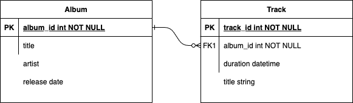

# Assignment - music-metadata-service

## Description

The '**music-metadata-service**' provides a REST interface for the users to perform below behavior on the album.
is a simple and scalable design which includes domain modeling, core service design, and behavior implementation.
This application uses HashMap as in-memory storage to store the album and tracks details.

## Table of Contents

- [Assumptions](#assumptions)
- [Domain Models](#Domain-Models)
- [ER Diagram](#ER-Diagram)
- [Core Service Design](#Core-Service-Design) 
- [Getting Started](#Getting-Started)
- [Project Structure](#Project-Structure)
- [Code Coverage-JaCoCo](#Code-Coverage)
- [Swagger](#Swagger-Link)
- [Spring Actuator](#Spring-Actuator)
- [Curl](#Curl-Request)

## Assumptions

1. Artist as a non-separate concept.
    * Reason: The artist is treated as an attribute of an album, and there is no standalone artist entity.
    * Impact: If this contract changes to incremental data, we need to add one more Entity to store the artist information

2. Album and Track Relationship
    * An album can have multiple tracks( 1:n) relationship. One track will only belong to single album.

3. Levenshtein distance algorithm
    * This application uses Apache library (org.apache.commons.lang3.StringUtils) for album title search behavior and edit count is less than 3.
   
4. Persistent Layer
   * Repository layer will abstract datastore interaction but won't be fully implemented, instead HashMap is used as local storage.

## Domain Models

Here we have two different models

1. **Album**
   1. There are multiple attribute can be taken into conisderation while creating Album, but for simplicity i have choosen to use
      name, artrist, release date and tracks.

2. **Track**
   1. Similarly, for track model, I have choosen parameters such as "track title, durations

## ER Diagram

## Core Service Design

### REST API Interface
The **AlbumController** class is responsible to expose the below endpoints to define required behavior.

POST http://localhost:8081/album  `Add an album with an artist`

GET http://127.0.0.1:8080/album?query=test `search for album by title using Levenshtein distance algorithm`

POST http://localhost:8081/album/{albumId}/tracks `add tracks to album`

PATCH http://localhost:8081/album/{albumId} `set album release date`

GET http://127.0.0.1:8080/album/{albumId}/is-released `a way to check if album is released`

### Persistent Layer Interface
The **IAlbumService** interface defines the abstraction of the underneath implementation of the persistent layer.

Below are the behavior a service layer should support.

    Album addAlbum(AlbumRequestBody albumRequest)

    Album addTracksToAlbum(String albumId, List<TrackRequestBody> trackRequests);

    Album setReleaseDate(String albumId, AlbumRequestBody albumRequest);

    Boolean isAlbumReleased(String albumId);

    List<Album> searchAlbumsByTitle(String title);

## Getting Started

## Build and run

For running this application there are the following options:

* Build and run using docker file
* Build and run using local tools:
* Build and run using IntelliJ/Eclipse IDE (dev setup)

### Simple build and run with docker

This option uses Java and Maven to build the application jar, and then Docker to build the Docker image.

* Requirements:
    * docker ([Docker Installation guide](https://docs.docker.com/engine/install))
    * Java 17 ([JDK Installation Guide](https://docs.oracle.com/en/java/javase/17/install/index.html))
    * Maven 3.9.7 ([Maven Installation Guide](https://maven.apache.org/install.html) )

* Build and run commands:
    * `mvn clean install`
    * `docker build -t music-metadata-service:0.1 -f docker/Dockerfile . `
    * `docker run -p 8080:8080 music-metadata-service:0.1`
    * `curl localhost:8080/priceservice/prices/13478`

### Build and run using local tools

In this option, Java and Maven are used to build the executable application jar, which is then run as a Java program.

* Requirements
    * java (17) jdk + jvm (for running the partner service)
    * Maven (installed locally)

* Compile and test commands:
    * Simple jar generation: `mvn clean install`
    * To run tests : `mvn test`

* Run the application
    * `java -jar target/music-metadata-service-0.0.1-SNAPSHOT.jar -Dspring.profiles.active=dev`

### Build and run using IntelliJ/Eclipse IDE

This approach required the import the codebase into the IDE as maven project.

* Requirements
    * java (17) jdk + jvm (for running the partner service)
    * Maven (installed locally)
    * IntelliJ/Eclipse

* Compile and test commands:
    * Import the project in IDE as maven project.
    * To run tests : `mvn test`
    * To build project : `project build`

* Run the application
    * Run the `com.assignmnt.ice.MusicMetadataServiceApplication` class as Java Program

### Run Test for Code Coverage

* Run `mvn test `
* code coverage report will be available under path `target/site/jacoco/index.html`

### Swagger

* http://localhost:8080/swagger-ui/index.html

### Spring Actuator

* http://localhost:8080/actuator/

## Project Structure

This structure of this project is based on multi-tier architecture where we have below components.

* `controller`: This layer is responsible for exposing the REST-based API that the user will call, and it is the
  entry point for the service.
* `service`: The service layer holds the classes responsible for having business logic.
* `exception`: contains Custom Exception classes and `GlobalExceptionHandler` to handle any exception in the
  application.
* `model`: contains the POJO classes used in the application.

### Code Coverage

* Mockito and SpringBoot test framework are used for Junit to achieve `85%+` code coverage.
* Unit test cases at controller cover all possible scenario of the request path attribute like empty,valid and invalid
  inputs.

### Swagger Link

- http://localhost:8080/swagger-ui/index.html

### Curl Request
` curl --location 'http://localhost:8081/album' --header 'Content-Type: application/json' --data '{"title":"Test Album","artist":"Test Album","releaseDate":[2024,12,18]}'

There are efficient datastore are available such as Elasticsearch and fuzzy/match query can be used.